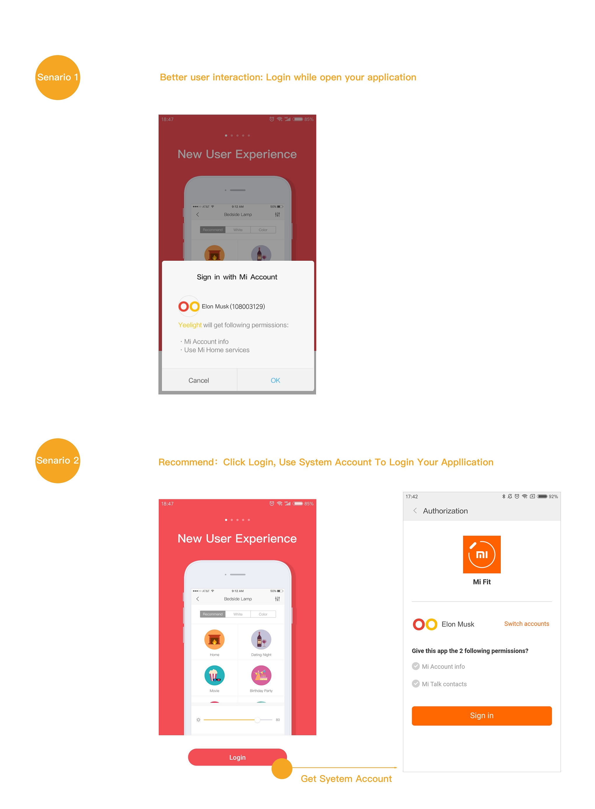

## Contextual Sign-in with Mi Account

With MIUI 8.2 released, contextual sign-in with Mi Account is coming soon, which can improve the account's sign-in rate on MIUI platform. On Android OAuth.1.5.jar and the following versions, this feature will be available just by adjusting Fast OAuth call logic.

1. Fast OAuth will automatically detect if there is an account on the MIUI environment to determine whether to call popup windows.
2. General contextual sign-in logic has 2 senarios: Login while open your aplication, Use System Account To Login your Application (you can decide other logic cases on your own after ensuring the user experience)
3. Fast OAuth interface documents & SDK: [https://github.com/xiaomi-passport/oauth-android-sdk](https://github.com/xiaomi-passport/oauth-android-sdk)

#### __Senarios__

