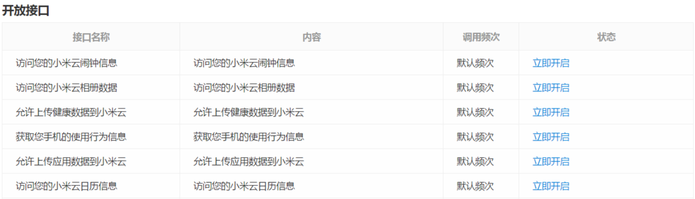

## XiaoMi Account Service Quick Access Guide

Mi Account service is based on the [OAuth 2.0](https://tools.ietf.org/html/rfc6749) Protocol's open authorization and related services, we aim to provide third-party developers and chain enterprises with more perfect, complete and easy-to-use account sign-in experience, bring users to your apps from MIUI's strong user base, and simplify the sign-in process on the MIUI platform. We provide multi-IDC worldwide services, and support different language interactions in more than 30 countries and regions with about 1 billion daily average service requests and service availability beyond 99.99% on a year-round basis.

### 1. How do I access Mi Account services?

__Attention__: Before you access Mi Account services, you need to register as a developer on the [Mi Dev Platform](https://dev.mi.com) and create the appropriate type of apps.

Follow the steps below to access Mi Account:

1. Enter [Mi Dev Platform](https://dev.mi.com), and tap [Management Console](https://dev.mi.com/console/man) in the upper right corner.
2. Select [Account Services](https://dev.mi.com/passport/oauth2/applist), enter your app's management page
3. Select the app you want to enable account services, click "Enable now" button, and fill in the redirect URI

__What is a redirect URI?__

OAuth 2.0 is a kind of callback-based authorization protocol. With redirect URI, authorized server can pass the issued authorization codes to relevant service interface in the form of 302 jumps. It protects the security of your users' access and the authorized server. Good redirect URI settings should make sure the issued authorization codes can be delivered to your server interface so as to request access token by the codes. Be aware of the following items when filling in the redirect URI:

1. Address you filled in must conform to the URI specifications, and you can modify it later.
2. You can configure multiple addresses and separate them by semicolons "`;`", such as `https://mi.com/;https://id.mi.com/`.
3. HTTP and HTTPS have different domains, for example, you need to fill in `http://mi.com/` and `https://mi.com/` separately.
4. For data redirect_urirequested to be passed, it's domain name can be that of the same level or sub-domain of the redirect URI entered when registering, and the path can be that of the same level or sub-path, while the SCHEME and port number must be the same.

__E.g. for Redirect URI:__

Assume that the redirect URI you entered when applying is: `https://abc.com/oauth`, so the redirect_uri's parameter can be:

> - https://abc.com/oauth?x=1&y=2
> - https://x.abc.com/oauth?x=1&y=2
> - https://x.abc.com/oauth/path?x=1&y=2

Can't be:

> - http://abc.com/oauth?x=1&y=2  // SCHEME don't match
> - https://abc.com:8080/oauth?x=1&y=2  // port numbers don't match

For detailed description of redirect URI, refer to the [OAuth 2.0 Protocol Principles](https://tools.ietf.org/html/rfc6749).

### 2. How to obtain the appropriate permissions?

A number of departments of Xiaomi worked together in Mi Dev Platform in order to provide developers with wide range of user data open interfaces. You can request corresponding interface permissions in the list of open interfaces (see image below) on specific app info page. Enter detailed reasons of application for the operators to review.

__About the interface permissions for sensitive user data such as users' phone numbers, emails:__

Xiaomi is a company that respects and protects users' privacy, and for sensitive data like users' mobile numbers and emails, Xiaomi Privacy Committee will verify the developer's identity strictly and check if it's necessary to access this type of data. The developers won't get such data easily, please be noted.

The application entrance is off by default, if you need the permissions of relevant interfaces, you can send email to [xiaomi-account-dev@xiaomi.com](mailto://xiaomi-account-dev@xiaomi.com) to apply.

### 3. Which grant type should I use?

Authorization code grant and implicit grant are provided for the developers. They should be used in particular cases. Unless your app doesn't have a server (such as browser plug-ins), __we strongly recommended that you use the authorization code grant__.

Compared to the implicit grant, the authorization code grant needs 1 more request, while with this grant type, the authenticity of the app can be verified based on client_secret to make sure the request won't be imitated. Meanwhile, the refresh token will be issued to refresh the access token in the background when the access token expired without another authorization from the user.

### 4. How to get help?

If you have any problems, send an email to [xiaomi-account-dev@xiaomi.com](mailto://xiaomi-account-dev@xiaomi.com) for help.

__Attention__:

This QQ group only talks about Mi Account access issues. In order to manage the group well, improve the response rate and solve the problems asked, you need to enter the APP ID(can be obtained from the app info page) in the notes, we will verify the info you entered, any unqualified applications will be declined.

### 5. Documents

#### 5.1 Beginner's guide

- [SDK download](sdk.html)
- [Xiaomi logo download](file/mi_logo.zip)
- [Contextual Sign-in with Mi Account](contextual-login.html)

#### 5.2 Grant permissions API

- [Authorization code grant type](authorization-code.html)
- [Implicit grant type](implicit.html)
- [Refresh access token](refresh-access-token.html)

#### 5.3 Open API

- [Account open data API](open-api.html)

#### 5.4 Others

- [Scope list](scope-list.html)
- [Error code list](error-code.html)
- [Token lift cycle](token-life-cycle.html)
- [MAC Signature Verification](mac-signature-verification.html)
- [FAQs](faq.md)

If you have any problem, you can contact with us by email: [xiaomi-account-dev@xiaomi.com](mailto://xiaomi-account-dev@xiaomi.com).
